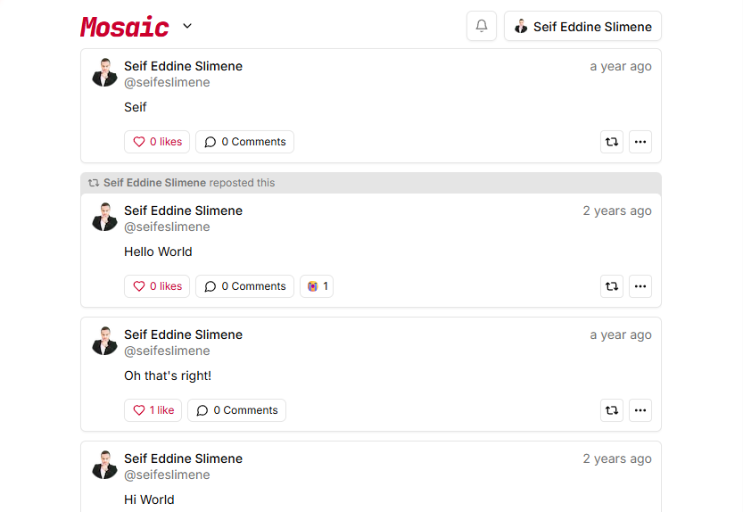
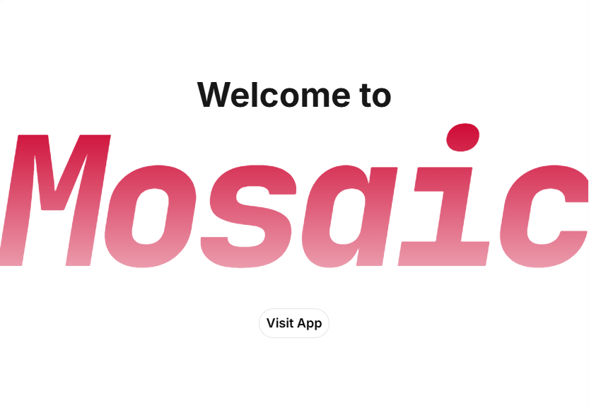

# Mosaic 🚀

Mosaic is a social media web app built with Next.js 14, Neon (PostgreSQL), and Clerk.
Deployed at: [mosaic.seifeddineslimene.com](https://mosaic.seifeddineslimene.com)

## Screenshots

### Feed (Desktop)



### Landing Page (Desktop)



## Features

- **User registration and login:** users can create an account and log in.
- **Posts CRUD:** users can create, read, update, and delete posts, and mention others.
- **Comments and likes:** users can like/comment on posts and add reactions.
- **Profile pages:** users can view their own and other profiles.
- **Following feed:** users can follow others and view a following timeline.
- **Notifications:** users are notified for events like likes and follows.
- **Responsive UI:** mobile-first design that also works on desktop.

## Tech Stack

Next.js, Neon serverless driver (PostgreSQL), Clerk, React Query, Tailwind CSS.
_Shadcn/ui is used for popover and dialog components, plus CSS variables._

Deployed on Vercel and Neon.

## Setup (Local Development)

### 1) Prerequisites

- Node.js 18+ (Node.js 20 recommended)
- `pnpm` (project uses `pnpm`)
- `psql` CLI (for restoring database dumps)
- A Neon PostgreSQL database
- A Clerk project (publishable + secret keys)

### 2) Install dependencies

```bash
pnpm install
```

> Note: use `pnpm` (not `npm`) for this project. The repo is locked with `pnpm-lock.yaml`, and `npm i` may resolve newer peer dependency versions that conflict with `next@14.1.0`.

If `pnpm` is not installed:

```bash
corepack enable
corepack prepare pnpm@9.15.4 --activate
pnpm install
```

If you accidentally ran `npm i` and got an `ERESOLVE` error, run:

```bash
pnpm install
```

### 3) Configure environment variables

Copy the example file and fill in real values:

```bash
cp .env.example .env
```

Required variables:

- `NEXT_PUBLIC_CLERK_PUBLISHABLE_KEY`
- `CLERK_SECRET_KEY`
- `NEXT_PUBLIC_URL` (for local dev: `http://localhost:3000`)
- `NEXT_PUBLIC_VAPID_PUBLIC_KEY`
- `VAPID_PRIVATE_KEY`
- `DATABASE_URL`

`DATABASE_URL` comes from your Neon project:

1. Open Neon dashboard and select your project.
2. Go to **Connection Details** (or **Connect**).
3. Copy the PostgreSQL connection string (URI format).

Example format:

```bash
postgresql://<user>:<password>@<host>/<database>?sslmode=require
```

Generate VAPID keys (if you do not already have them):

```bash
npx web-push generate-vapid-keys
```

### 4) Run the app

```bash
pnpm dev
```

Open [http://localhost:3000](http://localhost:3000).

## Restore Database Data

The repository includes `mosaic.sql` (table definitions). You can restore it into the database from your `DATABASE_URL`.

### Important: load `.env` variables in bash first

If `echo "$DATABASE_URL"` prints nothing, the variable is not available in your current shell yet.

Use:

```bash
set -a && source .env && set +a
```

What this does:

- `set -a`: enable auto-export for variable assignments.
- `source .env`: load `.env` in the current shell.
- `set +a`: disable auto-export (back to normal behavior).

Then verify:

```bash
echo "$DATABASE_URL"
```

### Option A: Restore from `mosaic.sql` in this repo

```bash
psql "$DATABASE_URL" -f mosaic.sql
```

### Option B: Restore from your own SQL dump file

```bash
psql "$DATABASE_URL" -f /path/to/your_dump.sql
```

### Verify tables were created

```bash
psql "$DATABASE_URL" -c "\dt"
```

